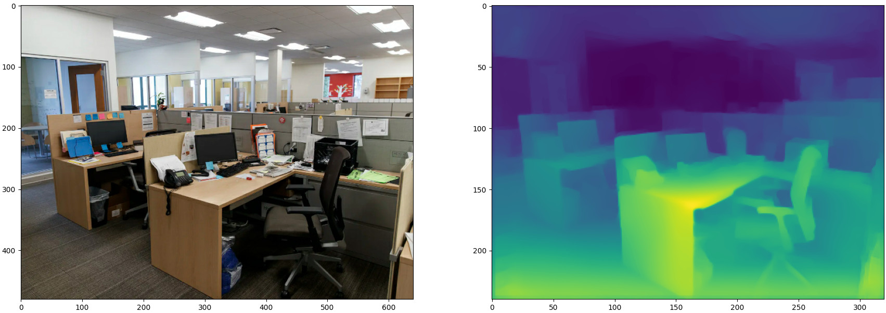

SLAM Winter School 2021 - Group Project

# Monocular Depth Estimation via Transfer Learning

**Team 9b:** Javed Ahmad, Yatharth Ahuja, Krunal Chande, Thomas Pintaric, Veeresh Taranalli

------

We implemented the encoder/decoder network as described in [Alhashim and Wonka, 2019] using the provided Python template code, which we split into different parts for training, evaluation and prediction.

### Model Training

Training the network is done by the script `train.py`. Upon completion, the trained model will be written to disk (`models/model.h5`). Optionally, `--train_on_multiple_gpus` can be used as a command-line argument to `train.py` on machines with multiple GPUs to speed up the training.

**Experiment 1:** Train the network using a **naive point-wise L1 loss function** based on the depth values, without any data augmentations:

`python ./train.py --batch_size=8 --epochs=15 --use_naive_L1_loss`

**Experiment 2:** Train the network using a **more complex loss function** similar to [Alhashim and Wonka, 2019], without any data augmentations:

`python ./train.py --batch_size=8 --epochs=15`

**Experiment 3:** Train the network using a loss function similar to [Alhashim and Wonka, 2019], **with added data augmentations**:

`python ./train.py --batch_size=8 --epochs=15 --apply_data_augmentations`

### Model Evaluation

We use the script `eval.py` is to evaluate a trained model, using the root mean squared error (RMSE) and mean absolute error (MAE) as performance metrics. Prior to invoking the evaluation script, the trained model should be copied to `models/model.h5`.

Example: `python ./eval.py --batch_size=8`

### Depth Image Prediction

The script `predict.py` will use a trained model to predict a depth image from an RGB color image. Prior to invoking the prediction script, the trained model should be copied to `models/model.h5`.

Example: `python ./predict.py --color_input=rgb_input.png --depth_output=predicted_depth.png`

Optionally, the command-line switch `--visualize_result` can be used to show a side-by-side comparison of input (RGB) and predicted output (DEPTH):

